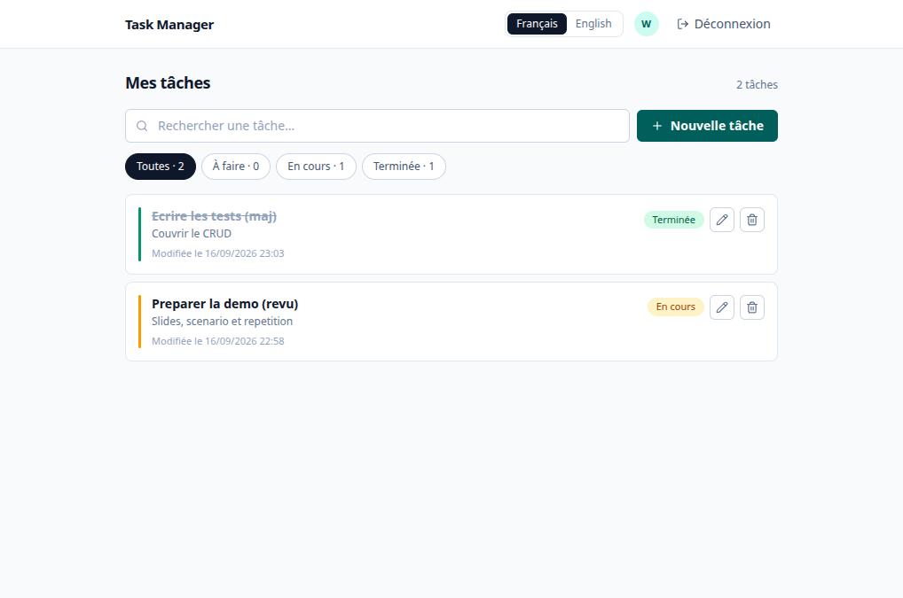
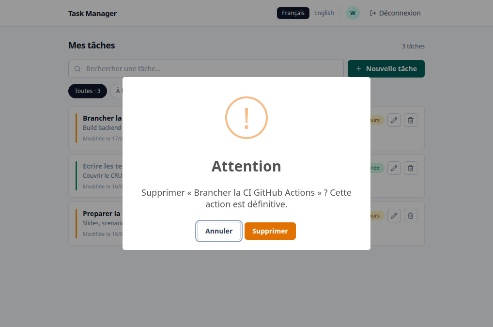
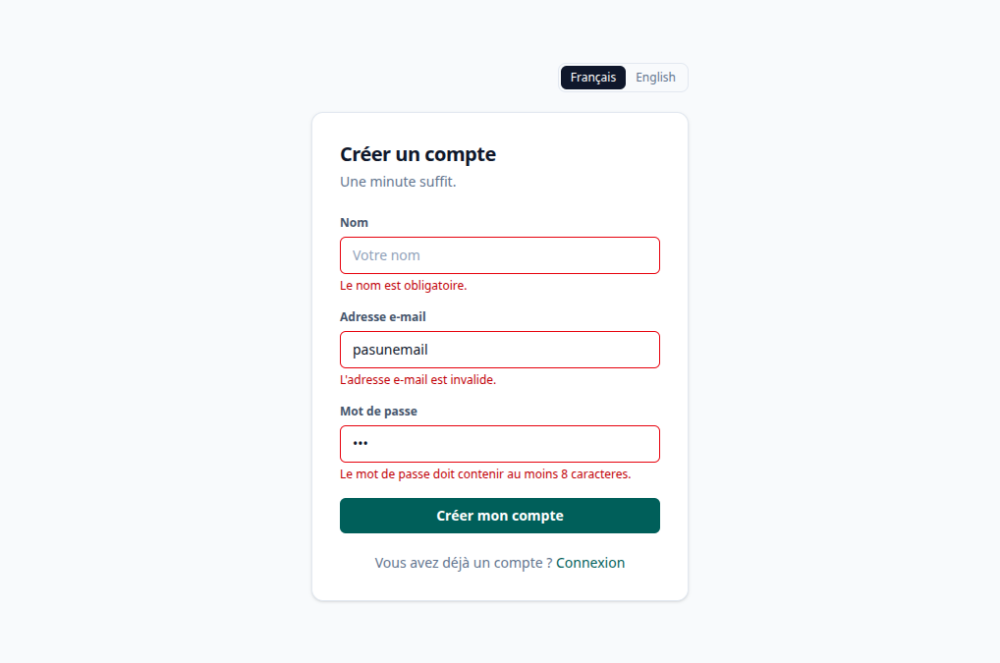

# Task Manager

Application de gestion de tâches multi-plateforme : API **Spring Boot**, frontend
**React**, application mobile **Flutter**, le tout internationalisé (FR / EN).

> Projet réalisé dans le cadre d'un test de recrutement.
> **État actuel : API, application web et application mobile terminées.**
> Authentification JWT, CRUD complet, filtres et recherche, le tout en français
> et en anglais sur les trois couches. La CI/CD est à venir.

---

## Stack technique

| Domaine | Technologies |
|---|---|
| Frontend Web | React 19 · Vite 8 · TypeScript 6 · Tailwind CSS 4 · i18next |
| Backend API | Java 21 · Spring Boot 4.1 · Spring Data JPA · Spring Security · JJWT |
| Base de données | MySQL 8.0 (Docker) |
| Mobile | Flutter 3.27 · Dart 3.6 · Dio · flutter_localizations |
| Outillage | Docker Compose · GitHub Actions · Google Cloud Run |

## Arborescence

```
.
├── backend/     API Spring Boot (Maven)
├── frontend/    Application web React + Vite
├── mobile/      Application Flutter
├── docs/        Documentation et captures
└── docker-compose.yml
```

---

## Prérequis

- **JDK 21**, **Node.js 20+**, **Docker** + Compose
- **Flutter 3.27+** (uniquement pour l'app mobile)

## Démarrage rapide

```bash
# 1. Secrets et configuration
cp .env.example .env        # renseigner les mots de passe

# 2. Base de données
docker compose up -d mysql

# 3. API  ->  http://localhost:8081
cd backend && ./mvnw spring-boot:run

# 4. Web  ->  http://localhost:5174
cd frontend && npm install && npm run dev

# 5. Mobile
cd mobile && flutter pub get && flutter run
```

### Ports

| Service | Port |
|---|---|
| API Spring Boot | `8081` |
| Frontend Vite | `5174` |
| MySQL | `3307` |

Ces ports s'écartent des valeurs par défaut (8080 / 5173 / 3306) parce que
celles-ci étaient déjà occupées sur la machine de développement. Ils se règlent
dans `.env`.

---

## API

Toutes les routes `/api/tasks` exigent l'en-tête `Authorization: Bearer <jeton>`.

| Méthode | Route | Rôle |
|---|---|---|
| `POST` | `/api/auth/register` | Inscription — renvoie un jeton (201) |
| `POST` | `/api/auth/login` | Connexion — renvoie un jeton (200) |
| `GET` | `/api/auth/me` | Profil de l'utilisateur connecté |
| `GET` | `/api/tasks?status=&search=` | Liste filtrée et triée par date de modification |
| `POST` | `/api/tasks` | Création (201) |
| `PUT` | `/api/tasks/{id}` | Modification |
| `DELETE` | `/api/tasks/{id}` | Suppression (204) |

Les erreurs partagent un corps unique, dont le message est **déjà traduit**
selon l'en-tête `Accept-Language` :

```json
{
  "status": 400,
  "message": "Les données envoyées sont invalides.",
  "fieldErrors": { "title": "Le titre de la tâche est obligatoire." },
  "timestamp": "2026-09-17T07:40:22.716Z"
}
```

---

## Choix techniques

**Proxy plutôt que CORS en développement.** Vite proxifie `/api` et `/actuator`
vers le backend : le navigateur ne voit qu'une seule origine, ce qui supprime
toute configuration CORS côté développement.

**MySQL conteneurisé.** La base tourne en conteneur avec un `healthcheck` et un
volume nommé : l'environnement est jetable et reproductible, sans interférer avec
les autres bases installées sur la machine.

**Configuration par variables d'environnement.** Ports, identifiants et secret JWT
viennent tous de `.env` (non versionné) ; `.env.example` sert de modèle. Aucun
secret n'est écrit dans le code ou dans `docker-compose.yml`.

**Internationalisation portée par `Accept-Language`.** Le web et le mobile
envoient la langue courante dans l'en-tête HTTP ; le backend y répond via son
`MessageSource`. L'API reste ainsi **sans état** et les deux clients partagent le
même mécanisme. Les clés de traduction sont **typées** côté React, et un test
vérifie que les bundles FR et EN exposent exactement les mêmes clés.

**Une seule source de vérité pour les messages métier.** Les formulaires sont en
`noValidate` : la validation native du navigateur produirait des messages dans la
langue du navigateur, pas celle de l'application. Les messages viennent donc tous
du backend, déjà traduits, et s'affichent sous le champ concerné.

**404 plutôt que 403 sur une tâche d'autrui.** Répondre 403 confirmerait
l'existence de l'identifiant et permettrait d'énumérer les tâches des autres
comptes. Un test verrouille ce comportement.

**Refus métier ≠ panne.** Un refus de règle (409, 400, 404) s'affiche en
SweetAlert *warning* ; l'icône *error* est réservée aux 5xx et aux coupures
réseau, pour qu'elle garde son poids. Aucune boîte native (`confirm`, `alert`)
n'est utilisée.

**Le statut ne repose jamais sur la couleur seule** : barre latérale, étiquette
textuelle et titre barré pour les tâches terminées.

---

## Tests

```bash
cd backend  && ./mvnw test      # 21 tests JUnit (API, i18n, isolation entre comptes)
cd mobile   && flutter test     # 16 tests (modèles, i18n, widgets)
cd frontend && npm run build    # vérification de types + build
cd frontend && npx oxlint src   # lint
```

Deux tests méritent d'être signalés, parce qu'ils verrouillent des règles qu'on
casse facilement sans s'en apercevoir :

- `TaskApiTest.repondEnNotFoundQuandUnAutreUtilisateurCibleLaTache` — une tâche
  d'autrui répond 404, jamais 403.
- `MessagesBundleTest.lesDeuxLanguesExposentExactementLesMemesCles` et son
  équivalent Flutter — ajouter une clé dans une seule langue casse le build.

---

## Documentation

- [Configuration de l'environnement, étape par étape](docs/ENVIRONNEMENT.md) —
  installation, pièges rencontrés, mise en place de l'i18n.

## Captures

**Liste des tâches**



| Confirmation de suppression | Validation du formulaire |
|---|---|
|  |  |
